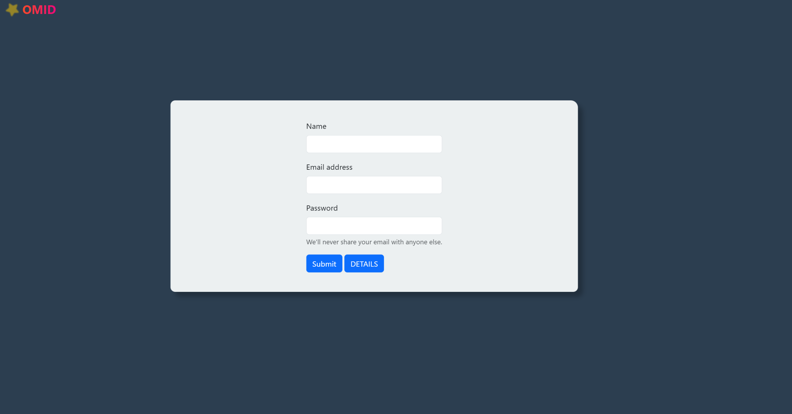

# MyLogin

## Table of Contents
- [Overview](#overview)
- [Features](#features)
- [Movie Demo](#movie-demo)
- [Contributing](#contributing)
- [Tips for Contributions](#tips-for-contributions)
- [Next Update](#next-update)
- [License](#license)

## Overview
🎉 MyLogin is an uncomplicated yet user-friendly login system designed to provide secure authentication for users. With a focus on functionality and elegance, MyLogin ensures a seamless experience for managing user accounts.

## Features
✨ **User Registration and Login**: Simple and intuitive user registration and login functionality.
🛡️ **Session Management**: Robust session management for secure and reliable user authentication.
🎨 **Customizable Forms**: Easily customizable login and registration forms to fit your application's design.

## Movie Demo 🎥
Check out our demo video showcasing the features of MyLogin:
[](img/myloginvid.mp4)

## Contributing
We welcome contributions! To contribute:
1. Fork the repository.
2. Create a new branch for your feature or bug fix:
   ```bash
   git checkout -b feature-name
   ```
3. Commit your changes:
   ```bash
   git commit -m "Add feature description"
   ```
4. Push your branch:
   ```bash
   git push origin feature-name
   ```
5. Submit a pull request.

## Tips for Contributions
💡 **Creating a Pull Request**:
- Ensure your code follows the project's coding standards.
- Include a clear and concise description of your changes in the pull request.
- Link any relevant issues in your pull request description.
- Be open to feedback and ready to make changes based on code reviews.

💡 **Reporting Issues**:
- Provide a detailed description of the issue.
- Include steps to reproduce the problem.
- Mention the expected and actual behavior.
- Attach screenshots or logs if applicable.

## Next Update
🚀 **Upcoming Feature**: Adding password hashing and salting for secure storage of user credentials. This enhancement will ensure even stronger protection for user data.

## License
📜 This project is licensed under the MIT License. See the [LICENSE](LICENSE) file for details
